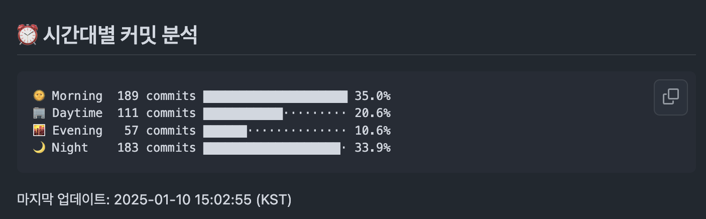

# 🕒 GitHub Commit Time Stats

[한국어](README.md) | [English](README_EN.md)

자신의 GitHub 커밋 시간대를 분석하여 프로필 README에 예쁘게 표시해주는 도구입니다.

> 🤖 이 프로젝트는 Claude AI의 도움을 받아 제작되었습니다.

## 🚀 설치 방법

1. **저장소 포크하기**
   - 이 저장소의 우측 상단에 있는 `Fork` 버튼을 클릭합니다.
   - 자신의 계정에 저장소가 복사됩니다.

2. **GitHub Personal Access Token 생성**
   - [GitHub Settings](https://github.com/settings/tokens)에서 새 토큰을 생성합니다.
   - `Generate new token (classic)` 선택
   - Note: `GT_TOKEN` (또는 원하는 이름)
   - Expiration: 원하는 기간 선택
   - Scopes:
     - ✓ `repo` (전체 선택)
   - `Generate token` 클릭하고 생성된 토큰을 복사해둡니다.

3. **저장소 설정**
   - 포크한 저장소의 `Settings` → `Secrets and variables` → `Actions` 이동
   - `New repository secret` 클릭
   - Name: `GT_TOKEN`
   - Value: 복사해둔 토큰 값 붙여넣기
   - `Add secret` 클릭

4. **GitHub 프로필 README 준비**
   - 자신의 GitHub 프로필 README 저장소가 없다면 생성
     - 자신의 GitHub 사용자명과 동일한 이름으로 새 저장소 생성
     - 예: `username/username`
     (위의 `{username}`을 자신의 GitHub 사용자명으로 변경)

## 🛠 기술 스택

- Python
- GitHub Actions
- GitHub API
- SVG 생성

## ⚙️ 작동 방식

- 매일 자정에 자동으로 통계가 업데이트됩니다.
- GitHub 프로필 README의 hits 배지 아래에 통계가 표시됩니다.
- 수동으로 업데이트하려면:
  1. 포크한 저장소의 `Actions` 탭으로 이동
  2. `Update Stats` 워크플로우 선택
  3. `Run workflow` 클릭

## 🎨 커스터마이징

통계 표시 방식을 수정하고 싶다면 `update_stats.py` 파일을 수정하세요:

- 시간대 구분 변경: `get_time_period()` 함수 수정
- 표시 형식 변경: stats_section 생성 부분 수정
- 업데이트 주기 변경: `.github/workflows/update-stats.yml`의 cron 설정 수정

## ❓ 문제 해결

- **통계가 업데이트되지 않는 경우**
  - GitHub Actions가 정상적으로 실행되고 있는지 확인하세요
  - Personal Access Token이 만료되지 않았는지 확인하세요
  
- **이미지가 표시되지 않는 경우**
  - 이미지 URL의 사용자명이 정확한지 확인하세요
  - 저장소 이름이 정확한지 확인하세요

## 📝 라이선스

이 프로젝트는 MIT 라이선스를 따릅니다. 자세한 내용은 [LICENSE](LICENSE) 파일을 참고해주세요.

## 🤝 기여하기

버그 리포트, 새로운 기능 제안, 풀 리퀘스트 모두 환영합니다!

## 👏 감사의 말

이 프로젝트는 GitHub API와 GitHub Actions를 사용합니다.
